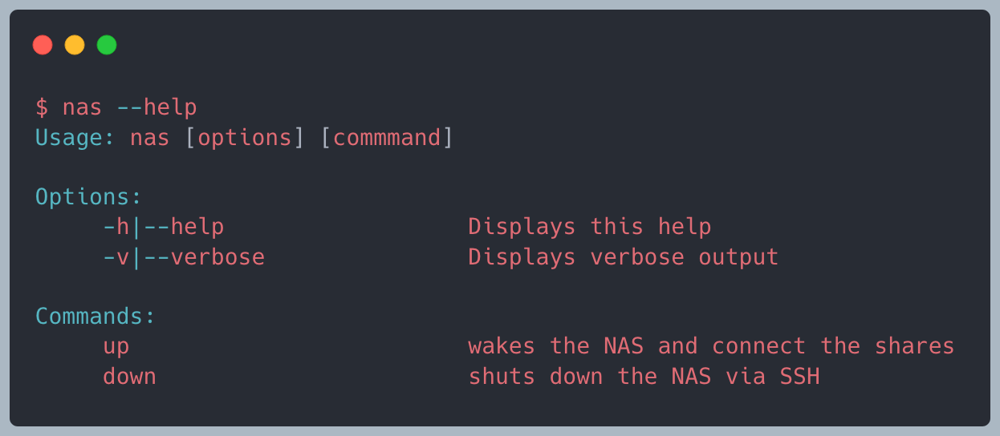

# 📚 About

_nas_ is a (not so) simple bash script for controlling your NAS (network attached storage). It allows the basic operations to wake and to shutdown the NAS. It also supports mounting a defined list of shares via the config file.

It's currently tested with a linux-based NAS from Synology on a macOS host (Big Sur).

It's developed for bash version <4 (e.g. shipped with Big Sur) and contains some quirks that are needed for such an old bash version (bash, version 3.2.57(1)-release is from 2007). It also works without changes on Monterey (12.1, 21C52).

## 💡 Note from the author

Hopefully, from an educational perspective, the 'how' instead of the 'what' of this bash script is interesting for the curious reader. It uses several bash (version <4) techniques like e.g. string and list processing, regex, default value handling, config file, a small parser for the config file format, checking for commands, trimming, timeout handling, port checks with netcat, etc. Have fun reading the [shellcheck](www.shellcheck.net)'ed code.

# Screenshot

_Note: color added for clarity_

# Prerequisites

- a machine running macOS (it's tested with Big Sur)
- homebrew (https://brew.sh)
- `brew install wakeonlan` \
  _I know the implementation uses perl, but the version of `netcat` shipped with macOS does not support the `-b` (for broadcast) option._ 😢
- SSH access and root access on your NAS
- enabled wake-on-lan on your NAS
- optional add your public ssh key to `authorized_keys` on your NAS

# Installation (proposal)

- create a `$HOME/bin` folder and add this folder to your `$path` environment variable
- copy (or symlink `ln -s`) `nas` and the `nas.env.example` into the `$HOME/bin` folder
- copy the `nas.env.example` file to `$HOME/.config/nas/nas`
- edit the file `$HOME/.config/nas/nas`:
  - _adjust_ the '_mandatory_' variables to your needs
  - _remove_ the '_optional_' variables if the defaults work for you
  - For your reference, my config only contains:
    - config_hostname
    - config_mac
    - config_shares
- macOS only: add the shares you want to mount after the host is up: `config_shares="Share1, Share2"`

# Usage

`$ nas up` \
wakes the NAS and mounts the configured shares

`$ nas down`\
shuts down the NAS

# Reading material

- https://www.cyberciti.biz/tips/bash-shell-parameter-substitution-2.html
- https://github.com/ralish/bash-script-template/
